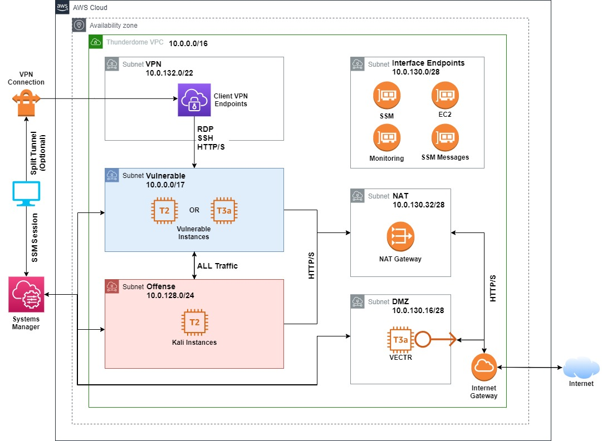

# Thunderdome Cyber Range

## Introduction

Thunderdome is a fully cloud-based cyberrange, deployed in AWS, that can be used by small teams to practice active offense/defense exercises including purple teaming, detection tuning, and incident response practice. 

## Network Diagram

## Design Details

This project organized into several modules. First is the VPC,  which contains the base network infrastructure, access control and network segmentation, VPC endpoints, launch templates, and various minor things. Next is the VPN module, which contains all of the resources which are needed to create the Client VPN endpoint. VPN Certificate management and user client configurations are handled 

**AWS CLI credentials need to be configured before doing anything.**

## Terraform

### Installation

`git clone <clone url> && cd thunderdome/`

`cd scripts/ && ./setup.sh`

If you want to use the Client VPN option:

`./gen_vpn_certs.sh`

### Workflow

*General Spin Up/ Tear Down:*
`terraform plan`
`terraform apply [-auto-approve]`
`terraform destroy [-auto-approve]`

*Making Changes to Existing Resources:*
* `terraform state list` - List current resources
* `terraform state rm <resource>` - Remove a resource from the state 
* `terraform import <name> <aws-id>` - Import an existing resource into the state 
* `terraform state show <name>` - After importing, use to get the current config JSON then copy paste into the .tf file
* `terraform refresh` - Refresh the current state based on the source files

### Terraform Notes

Most, if not all, terraform commands need to be run from the root module (`thunderdome/infra`). Each module contains a `main.tf` that contains the core resources for that module, `variables.tf` which contains the input variables, and `outputs.tf` which are the values export from the module. Outputs from the root module are printed to the terminal after a successful `terraform apply`.

In order to use a value from one module in another, it is necessary to export the desired value in the `outputs.tf` in the source module and create a variable for that value in the destination module. This value is assigned to the variable in the root module in the block where the destination module is defined.

There are some actions which can't be completed with Terraform. In those cases, if the action can be done with the awscli, you can create a `null` resource to run the awscli command locally to perform the action.

To generate new input/output documentation for each module, simply run `scripts/gen_terraform_docs.sh` which uses `terrraform-docs`.

## Client VPN Endpoint Details

* Client VPN Endpoint details configured in `thunderdome/infra/modules/client-vpn/main.tf`:
	* Domain validation via Route 53
	* CIDR Block
	* Securtiy Group
	* Subnet Associations
	* Transport Protocol
	* Connection Logging
	* Server certificate ARN
	* Split Tunnel

### Generate VPN certs

Running `scripts/gen_vpn_certs.sh` will generate the necessary certificates and keys and upload the server certificate to AWS ACM. Resulting files will be placed in `.vpn-info/`.

### Client Configuration File

When the VPC is created via terraform, the configuration file for the Client VPN Endpoint will be automatically downloaded to `.vpn-info/config.ovpn`. 

### Initiate VPN Connection
`sudo openvpn config.ovpn`

*Verify `tun` interface created and an IP in 10.0.132.0/22 assigned*

### VPN connection Logging

Connections to the Client VPN Endpoint are logged to the `thunderdome_vpn_connection_logs` Log Stream in the `thunderdome_vpn` Log Group in CloudWatch.

## SSM Setup

### Configure SSM Preferences
`AWS Systems Manager Console > Instances & Nodes > Session Manager > Preferences`
Options that can be changed here include:
*	S3 configuration (enable, bucket name, encryption)
	- Currently configured to use `thunderdome-ssm-logs`.
* 	Run as user (ec2-user, ubuntu, etc.)
*	CloudWatch log stream / log group

### Local Setup

[Install the SSM commandline plugin](https://docs.aws.amazon.com/systems-manager/latest/userguide/session-manager-working-with-install-plugin.html)

[Enable SSH & SCP through SSM](https://docs.aws.amazon.com/systems-manager/latest/userguide/session-manager-getting-started-enable-ssh-connections.html)

### Using SSM to connect to Instances

**AWS CLI:**

`aws ssm start-session --target <instance-id>`

**SSH/SCP:**

`ssh -i <key-file> <username>@<instance-id>`

`scp -i <key-file> /local/path <username>@<instance-id>:/remote/path`

## Building AMIs

Custom AMIs are built using [Packer](https://packer.io/docs/). They can either be started from an existing AMI, an ISO, or OVF. If starting from an ISO or OVF, the machine must first be built locally on a hypervisor (VMWare, Virtualbox), exported, uploaded to S3, and have the `vmimport` process started on it. Packer can handle all of this automatically. When building a machine locally, make sure your system has enough resources allocated to be able to build the VM.  

### Using Packer

Useful commands:

`packer fix template.json` - Linter, need to copy & paste to source file

`packer validate template.json` - Template validation

`packer build template.json` - Build AMI from template

Debugging:

`tail -f /tmp/packer-log*` - Follow log file

`export PACKER_LOG=1` - Send DEBUG logs to stdout, set prior to building

`export AWS_MAX_ATTEMPTS=1500` - Increase number of tries to upload image. default 720 attempts, 5sec interval between each

`packer build -debug -on-error=ask template.json` - Build and interact on error

### Finding Existing AMIs

You can search for a particular AWS Marketplace AMI [here](https://aws.amazon.com/marketplace/search/results?page=1&filters=fulfillment_options&fulfillment_options=AMI) or from the Launch Instance Wizard in the EC2 console.

To retrieve the owner id for an AMI (needed for Packer template), you can do the following:

Search for and select desired image > Click `Continue to Subscribe` > Click `Continue to Configuration` > Get `ami-id` from page

`aws ec2 describe-images --image-ids <ami-id> --region us-east-1 | jq -r .Images[0].OwnerId`

OR to list all available versions of a particular AMI along with the owner id:

Search for and select desired image > Click `Continue to Subscribe` > get value of `productId` parameter from URL

`aws ec2 describe-images --owners aws-marketplace --filters "Name=name,Values=*<productID>*" | jq -r '.Images[] | "\(.OwnerId)\t\(.Name)"'`

To find an AWS Community AMI:

EC2 Console Dashboard > `Launch Instance` > Search for desired AMI and select `Community AMIs` on the left.

AMIs that your account has access to, including those owned by you can be viewed in `EC2 Console > Images > AMIs`. Filter in the search bar.

## Acknowledgements

[VECTR](https://github.com/SecurityRiskAdvisors/VECTR)

[Kali](https://www.offensive-security.com/kali-linux-vm-vmware-virtualbox-image-download/)

[Terraform](https://terraform.io)

[Packer](https://packer.io)

[terraform-docs](https://github.com/segmentio/terraform-docs)

[EasyRSA](https://github.com/OpenVPN/easy-rsa)

## License

[MIT License](./LICENSE.txt)

Copyright (c) 2020 Michael Ibeh
 